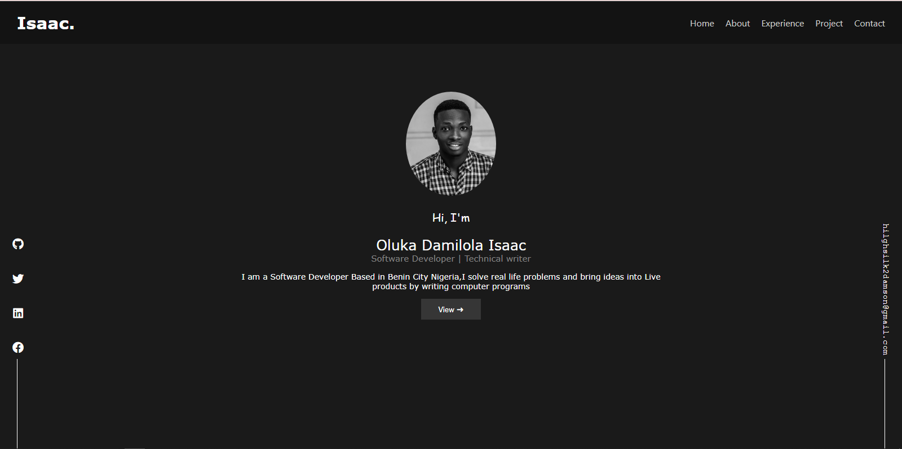

# My-portfolio

### Description: 
My official  portfolio website which contains my experiences, projects i have worked on and other little information about me.


### Technology stack:
* ReactJS
* SCSS

### Status: 
webapp still under development.


### Image: 
   |   
 
 


### live preview:  
https://olukaisaac.netlify.app/

### Setup:
1. Copy the repository link 
2. On your commandline/terminal, change the current working directory to the location where you want the cloned directory.
3. Type ``` git clone https://github.com/USER_NAME/REPOSITORY_NAME```.(make sure the link is the link to the repository)
4. press enter to create your local clone.
5. install all required depencies by running ``` npm install --save ```.

### Reqirement & Resources for development: 
 * Any IDE (VSCode, Bracket, Atom, Sublime e.t.c)
 * Basic knowledge with ReactJS

